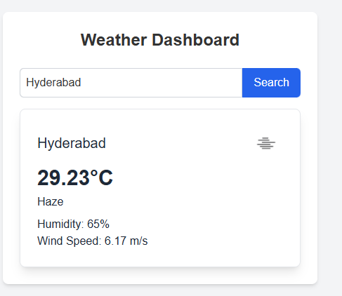

# Weather Dashboard

A clean and professional weather dashboard built with React, displaying real-time weather data from the OpenWeatherMap API.

## Features

- Search weather by city name
- Displays current temperature, weather description, humidity, and wind speed
- Responsive and clean UI with Tailwind CSS

